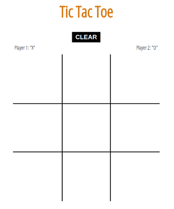

# Tic-Tac-Toe
Tic Tac Toe game built in Javascript

**Link to project:** https://eloquent-booth-3c7790.netlify.com

## How It's Made:

**Tech used:** HTML5, CSS3, JavaScript.

## Lessons Learned:
Learned how to use 2d arrays to better loop through the winning conditionals

## Examples:

**To-do List:** https://github.com/Eriquette/todo-list-2018c-week05/tree/answer

**Daily Code Challenges:** https://github.com/Eriquette/Daily-Code-Challenges

**OOP Calculator:** https://github.com/Eriquette/week01-alumni-project-calculator/tree/answer
